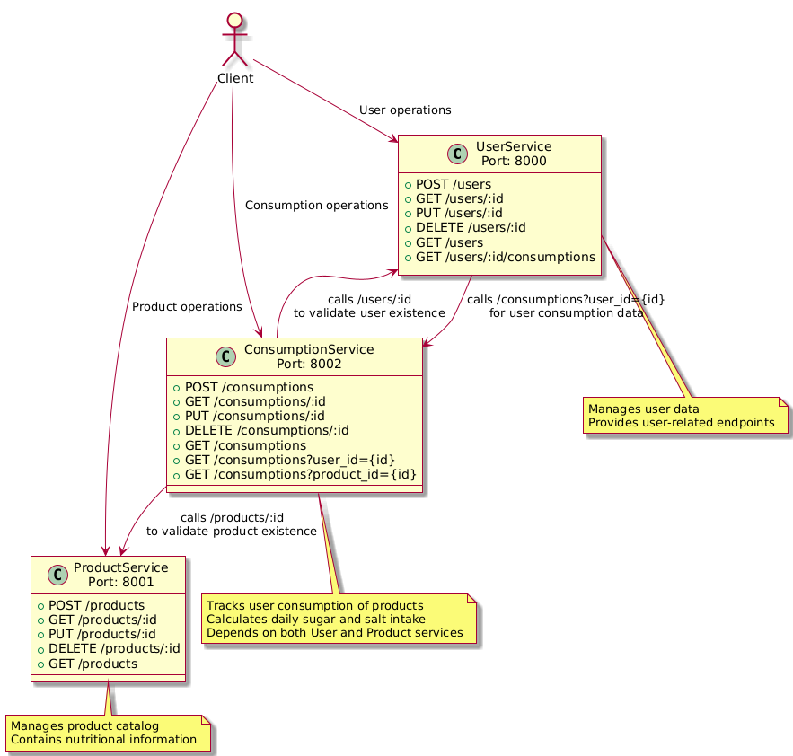
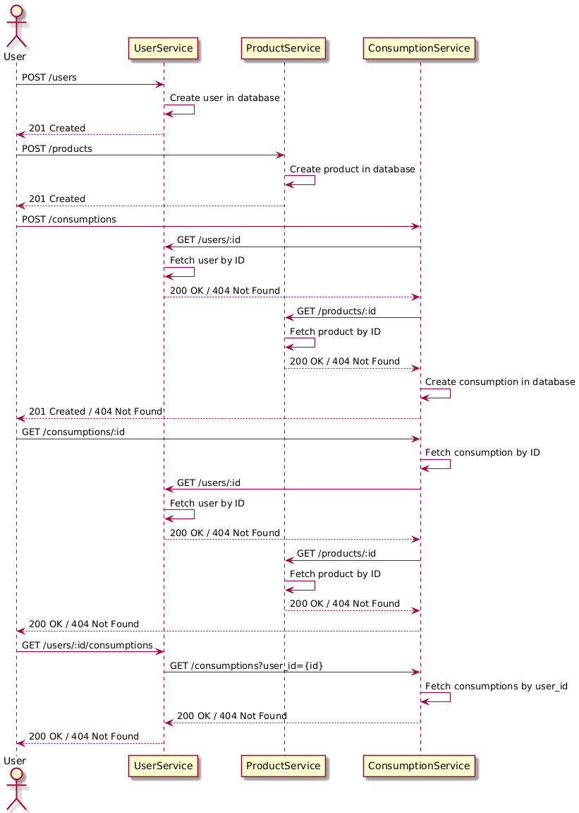

# NutriLens Microservices

This project is a monorepo containing three distinct services: UserService, ProductService, and ConsumptionService. Each service is built using Node.js with the Fastify framework and utilizes SQLite3 for data storage. The services are designed to handle CRUD operations and are isolated in their respective directories.

## Team Developers

This project is developed and maintained by the NutriLens team:

- **Andri Junaedi** - [@andrijunaedi](https://github.com/andrijunaedi)
- **Glen Davis Kusuma** - [@glenkusuma](https://github.com/glenkusuma)
- **Muhammad Hanif Aulia Rasyid** - [@HanifAR24](https://github.com/HanifAR24)

## Diagram

### Architecture Microservices



### Sequence Diagram



## Services Overview

### 1. UserService

- **Port**: 8000
- **Description**: Manages user data and provides endpoints for user-related operations.
- **CRUD Operations**: Create, Read, Update, Delete user information.
- **Documentation**: Available in `services/UserService/swagger.yaml`.

### 2. ProductService

- **Port**: 8001
- **Description**: Manages product data and provides endpoints for product-related operations.
- **CRUD Operations**: Create, Read, Update, Delete product information.
- **Documentation**: Available in `services/ProductService/swagger.yaml`.

### 3. ConsumptionService

- **Port**: 8002
- **Description**: Manages consumption records for users, specifically tracking daily sugar and salt intake.
- **CRUD Operations**: Create, Read, Update, Delete consumption records.
- **Documentation**: Available in `services/ConsumptionService/swagger.yaml`.

## Project Structure

```
nutrilens-microservices
├── services
│   ├── UserService
│   ├── ProductService
│   └── ConsumptionService
├── docs
├── package.json
├── README.md
└── .gitignore
```

## Setup Instructions

1. **Clone the Repository**

   ```bash
   git clone https://github.com/andrijunaedi/nutrilens-microservices.git
   cd nutrilens-microservices
   ```

2. **Install Dependencies**
   Each service has its own `package.json`. Navigate to each service directory and install dependencies:

   ```bash
   npm install
   ```

3. **Run the Services**
   Each service can be started independently on its designated port:

   - Start UserService:
     ```bash
     npm run start:user
     ```
   - Start ProductService:
     ```bash
     npm run start:production
     ```
   - Start ConsumptionService:
     ```bash
     npm run start:consumption
     ```

   Alternatively, you can run all services simultaneously using the root `package.json` script:

   ```bash
   npm run start
   ```

4. **Access the APIs**

   - UserService: `http://localhost:8000`
   - ProductService: `http://localhost:8001`
   - ConsumptionService: `http://localhost:8002`

5. **Access the API Documentation (Swagger)**
   - UserService: `http://localhost:8000/docs#/`
   - ProductService: `http://localhost:8001/docs#/`
   - ConsumptionService: `http://localhost:8002/docs#/`

## Integration

The services are designed to interact with each other via RESTful APIs, allowing for a cohesive system that tracks user consumption of sugar and salt daily.

## License

This project is licensed under the MIT License.
